# booking-and-more — Felhasználói útmutató

_Egyszerű nyelvezetű útmutató a booking-and-more platform használatához: mit csinál az egyes képernyő, ki mit tehet meg, és hogyan jut el egy időpontfoglalás az ügyfél telefonjától a csapat napi teendőiig._

---

## Mi ez, egy mondatban?

Ez a **saját online időpontfoglaló oldalad, mögötte egy irányítópulttal, ahol a csapatod kezeli a naptárat** — így az ügyfelek hajnali kettőkor is lefoglalják maguknak az időpontot, a munkatársaid pedig teljes kontroll alatt tartják, ki mikor és mire elérhető.

Minden vállalkozás teljesen elkülönül a platformon a többitől: a szolgáltatásaid, a munkatársaid, a helyszíneid, az ügyfeleid. Senki más nem látja őket.

**Klinikák, szalonok és stúdiók** számára készült — bárhol, ahol az emberek egy megnevezett személyhez foglalnak időt egy megnevezett szolgáltatásra.

---

## A termék két fele

### 1. A nyilvános foglalási oldalad 🌐

Egy oldal a saját címeden — `sajatvallalkozasod.example.com/sajat-azonosito/book` —, amit bárki megnyithat fiók nélkül. Öt rövid lépésben kiválasztják a szolgáltatást, kiválasztják, kihez szeretnének menni, kiválasztanak egy időpontot egy valódi naptárból, megadják az adataikat, és kész is a foglalás. Azonnal kapnak egy e-mailt egy linkkel, amivel módosíthatják vagy lemondhatják a foglalást.

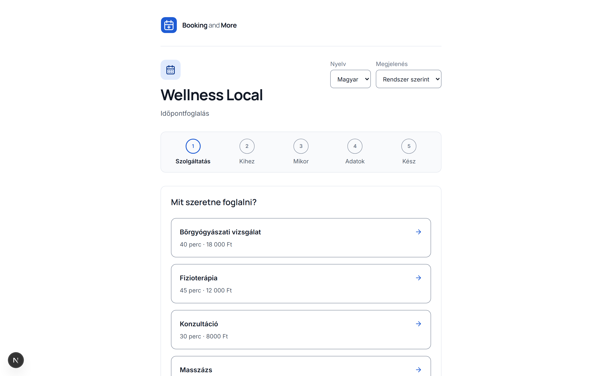

### 2. A munkatársi irányítópult 💻

Itt jelentkezik be a csapatod. Itt található az általad kínált katalógus (szolgáltatások, emberek, helyek), az egyes szolgáltatók munkarendje, valamint a napi foglalások listája. A csapatod elfogadja a kéréseket, átütemez, lemond, és megjelöli, ki jelent meg és ki nem.

Mindkét fél ugyanazt a naptárt olvassa, így soha nincs egy második, külön karbantartandó naptár.

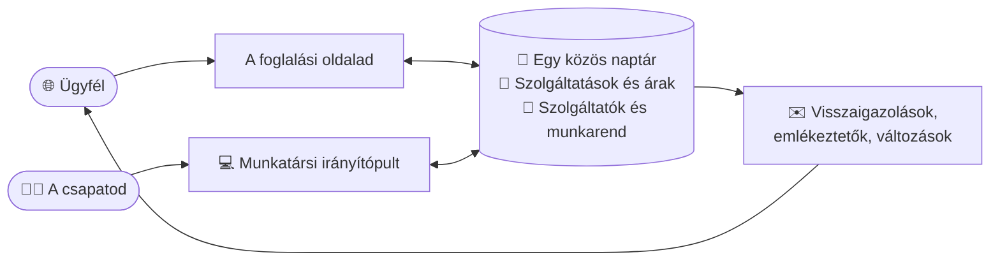

---

## Első lépések — hogyan jutottál idáig

A booking-and-more nem olyasmi, amire önállóan regisztrálsz. **Mi állítjuk be a vállalkozásodat, és e-mailben küldünk neked meghívót.** Ez szándékos: azt jelenti, hogy a vállalkozásod neve, webcíme és nyelve már az első képernyőtől kezdve helyesen jelenik meg.

Íme a teljes út a meghívó e-mailtől a működő foglalási oldalig:

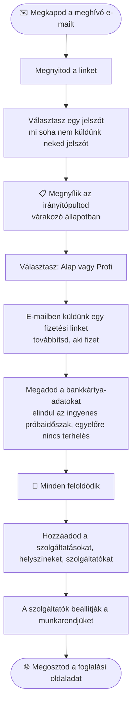

### A meghívó

A meghívó e-mailben lévő link **egyszer használatos és időkorlátos**. Nyisd meg, válassz jelszót, és már bent is vagy — te leszel a vállalkozás **tulajdonosa**.

Ha már be vagy jelentkezve valaki másként, amikor megnyitod, a képernyő ezt egyértelműen jelzi, és felajánlja, hogy előbb kijelentkeztet. Ha a link elévült, kérj egy újat — egy friss link másodpercek alatt kiállításra kerül, és a régi ezután nem működik.

### A várakozó állapot

Mielőtt elindulna az előfizetésed, az irányítópultod egy rövid üdvözlőképernyőt mutat a teljes termék helyett:

> **Üdvözlünk, {vállalkozásod neve}**
> A vállalkozásod be van állítva, és az előfizetésére vár. Íme, mi következik.

Felsorolja az előtted álló három lépést — előfizetés, beállítás, foglalások fogadása —, és visszaszámolja a hátralévő napokat az előfizetésig. **A szolgáltatók, szolgáltatások, helyszínek, elérhetőség és foglalások zárolva maradnak, amíg az előfizetés el nem indul.** Csak két képernyő működik: ez az áttekintés, és az Előfizetés, ami ezt feloldja.

---

## Az előfizetésed

Nyisd meg az **Előfizetés** menüpontot az oldalsávban. Két csomagot fogsz látni:

| Csomag                  | Mire való                                                                                              |
| ----------------------- | -------------------------------------------------------------------------------------------------------- |
| **Alap**                | Irányítópult és nyilvános foglalási űrlap havi 9990 Ft-ért, áfával együtt                              |
| **AI Recepciós**        | Alap csomag plusz AI chat, widget, átiratok, és havi 2M/400K token havi 24 990 Ft-ért, áfával együtt |

Válassz egyet, és nyomd meg a **Küldd el a fizetési linket** gombot. E-mailben küldünk egy biztonságos fizetési oldalt a címedre — továbbíthatod annak, aki intézi a pénzügyeket, ezért érkezik e-mailben ahelyett, hogy azonnal megnyílna.

### Az ingyenes próbaidőszak

Az új vállalkozások **30 nap ingyenes próbaidőszakot** kapnak. A kártyaadatokat az elején rögzítjük, de **semmit nem terhelünk a próbaidőszak végéig**, és bármikor lemondhatod, mielőtt véget érne. A képernyő pontosan megmutatja, mikor: _"Az ingyenes próbaidőszakod {dátum}-kor ér véget. Ezután számlázunk a(z) {csomag} csomagért."_

Egy vállalkozás csak egy próbaidőszakot kaphat. Ha a tiéd már felhasználásra került, a képernyő ezt jelzi, és a számlázás azonnal elindul.

### Amint előfizettél

Az Előfizetés képernyő lesz a számlázási központod:

- A **Számlázás kezelése** egy biztonságos portált nyit meg, ahol lecserélheted a kártyát, letöltheted a számláidat, vagy lemondhatod az előfizetést. Utána visszakerülsz ide.
- **Csomagváltás** — a frissítés azonnal életbe lép; a visszaminősítés ütemezve van, és a képernyő megmutatja a dátumot: _"A csomagod {dátum}-kor változik erre: {csomag}."_
- **Lemondás** esetén nem szakad meg azonnal a szolgáltatás. A képernyő erre vált: _"Véget ér ekkor: {dátum}"_, és bármikor újraindíthatod addig.
- **Egy sikertelen fizetés** nem kapcsol ki semmit azonnal. Egy értesítést fogsz látni, hogy frissítsd a kártyaadataidat, miközben a szolgáltatásod tovább fut.

---

## A katalógusod felépítése

Három képernyő, és a sorrend számít. **Először a szolgáltatások, aztán a helyszínek, végül a szolgáltatók** — mert egy szolgáltatót _egy szolgáltatásra_ foglalnak, így egy elsőként létrehozott szolgáltatónak nincs mit kínálnia, és egyáltalán nem jelenhet meg a foglalási oldaladon.

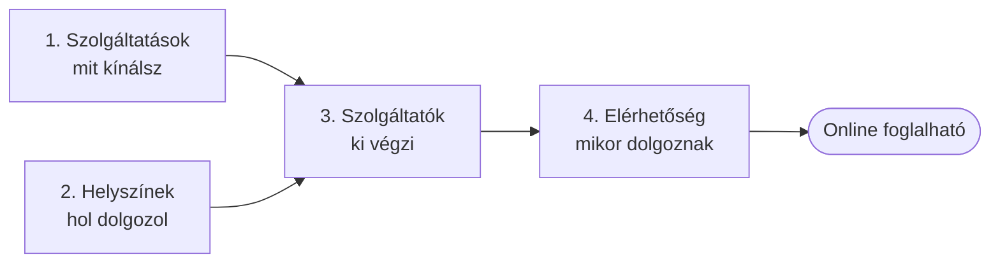

---

## Szolgáltatások — amit kínálsz

**Irányítópult → Szolgáltatások → Szolgáltatás hozzáadása.**

Egy szolgáltatás egy foglalható dolog: egy kontrollvizsgálat, egy vágás és festés, egy 50 perces alkalom.

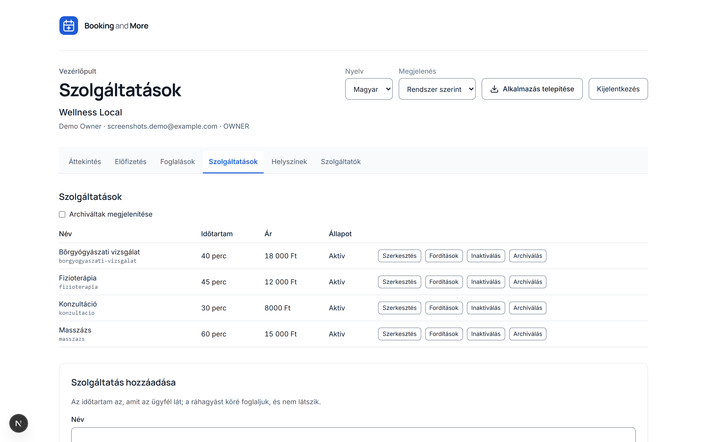

| Mező                            | Mire való                                                                                                                              |
| -------------------------------- | ---------------------------------------------------------------------------------------------------------------------------------------- |
| **Név** és **Leírás**       | Amit az ügyfél a foglalási oldalon olvas                                                                                                  |
| **Időtartam**                | Milyen hosszú az időpont — **ezt látja az ügyfél**                                                                                |
| **Puffer előtte / utána** | Extra percek az időpont körül. **Az ügyfelek soha nem látják őket** — használd takarításra vagy jegyzeteléshez |
| **Ár**                         | Hagyd üresen, és a foglalási oldal helyette azt írja: _"Ár megkérdezésre"_                                                              |
| **URL-név**                    | A foglalási linkjeidben jelenik meg. Hagyd üresen, és a névből építünk egyet                                                    |

### A három beállítás, amit érdemes megérteni

**Jóváhagyást igényel a visszaigazolás előtt.** Kapcsold be, és a foglalások _kérésként_ érkeznek, nem visszaigazolt időpontként. Az ügyfél kap egy üzenetet, hogy a vállalkozás hamarosan visszaigazolja, és az időpont a Foglalások képernyőn vár, amíg valaki meg nem nyomja az Elfogadást. Használd ott, ahol szeretnéd átnézni, ki jön be; hagyd kikapcsolva, ahol örülsz az automatikus foglalásnak.

**Minimális határidő (perc).** Milyen közel az időponthoz foglalhat még valaki. Állítsd 120-ra, és senki nem foglalhat le egy két óránál közelebbi időpontot.

**Foglalható ennyi napra előre.** Milyen messzire a jövőbe van nyitva a naptárad.

Mindkét utolsó beállítás üresen hagyható, hogy **örökölje** a vállalkozás egészére érvényes beállítást. Vigyázz: az _üres_ és a _nulla_ nem ugyanaz. Az üres azt jelenti: "használd az alapértelmezettet"; a nulla azt jelenti: "az utolsó másodpercig foglalható". A képernyő megmutatja, melyik alapértelmezettet örököltétek, és figyelmeztet, ha olyan szűk ablakot állítottál be, hogy az ügyfelek szinte semmit nem fognak látni.

### Kikapcsolás

Két különböző kérdés, mindkettő elérhető:

- **Inaktiválás** — egyelőre kikapcsolva. Eltűnik a foglalási oldalról, és bármikor visszakapcsolható.
- **Archiválás** — végleges. Teljesen eltűnik a munkalistából.

**Soha semmi nem törlődik ténylegesen.** A régi időpontok továbbra is arra a szolgáltatásra mutatnak, amire foglalták őket, így az előzményeid épek maradnak, és helyesen áraznak. Pipáld be az **Archiváltak megjelenítése** opciót, hogy lásd az archivált sorokat, és a **Visszaállítás** gombbal hozd vissza őket. Ha valamit létre akarsz hozni, és azt a választ kapod, hogy a név foglalt, az általában egy archivált sor — állítsd vissza ahelyett, hogy duplikátumot hoznál létre.

---

## Helyszínek — ahol dolgozol

**Irányítópult → Helyszínek → Helyszín hozzáadása.**

Egy helyszín az egyik telephelyed. Négyféle van:

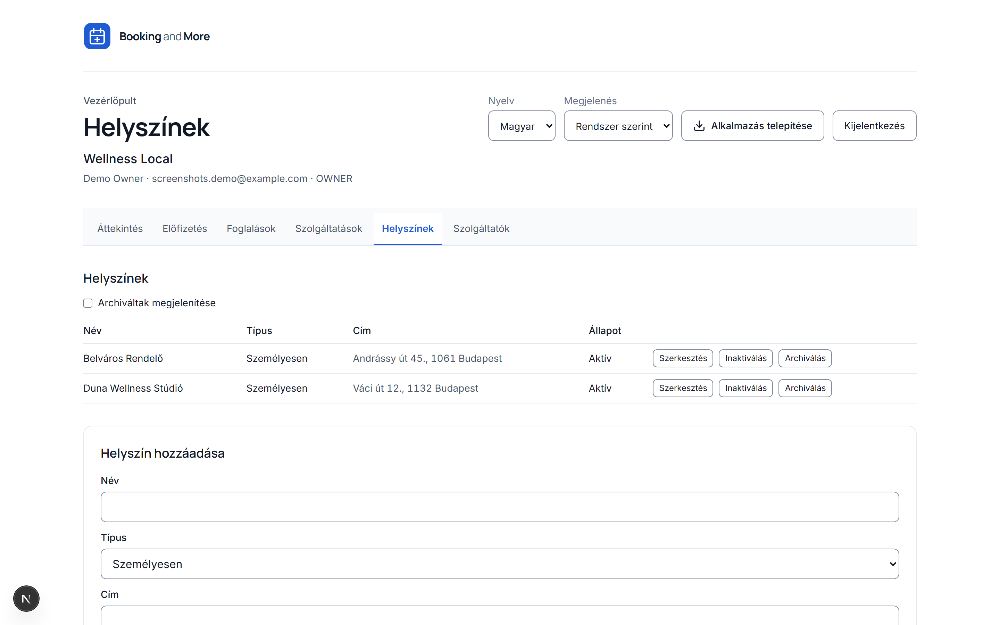

| Típus              | Mire használd                             |
| -------------------- | -------------------------------------------- |
| **Személyesen**    | Egy fizikai cím, ahová az ügyfelek eljönnek |
| **Online**          | Videós időpontok                          |
| **Házhoz kiszállás** | Te utazol hozzájuk                          |
| **Telefonos**      | Telefonos konzultációk                     |

Fizikai telephelyekhez add meg a címet, irányítószámot, várost és országot. A **térkép-koordináták** opcionálisak, és lehetővé teszik, hogy a foglalási oldal a megfelelő pontra mutasson.

Az **időzóna** megjegyzést érdemel: hagyd üresen, és a helyszín a vállalkozásod saját zónáját használja. Csak akkor állítsd be, ha valóban egy másik zónában üzemeltetsz egy telephelyet — az ottani időpontok ezután abban a zónában jelennek meg.

> **Lehet, hogy egyáltalán nincs szükséged helyszínre.** Ha minden tevékenységed online vagy telefonon zajlik, hagyd ki teljesen ezt a képernyőt. A helyszínek azt írják le, hol dolgozik fizikailag valaki; nem szükségesek ahhoz, hogy egy foglalás létrejöjjön.

---

## Szolgáltatók — akikhez az ügyfelek foglalnak

**Irányítópult → Szolgáltatók → Szolgáltató hozzáadása.**

Egy szolgáltató az, akihez az időpontokat foglalják. Fontos, hogy **egy szolgáltató létrehozása nem ad neki bejelentkezést** — ez egy külön lépés, lentebb tárgyaljuk.

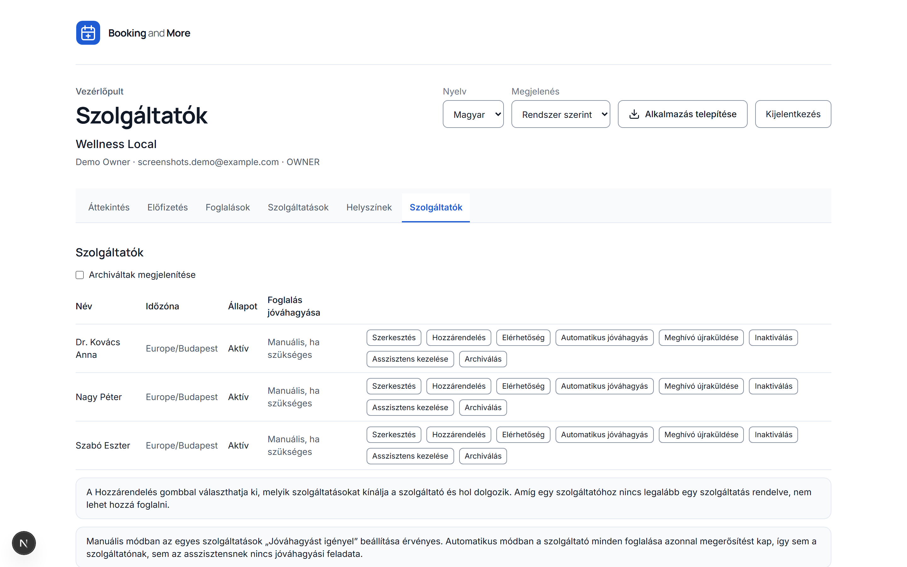

| Mező                              | Mire való                                                                                                     |
| ----------------------------------- | ------------------------------------------------------------------------------------------------------------- |
| **Név, e-mail, telefonszám**   | A rekordjuk. Az e-mail címre érkezne egy meghívó is                                                          |
| **Beszélt nyelvek**              | Magyar, angol, német, francia — az ügyfelek választását segíti                                              |
| **Online foglalható**            | Kapcsold **ki**, hogy valaki ne jelenjen meg a nyilvános foglalási oldalon, miközben a csapatod telefonon még foglal neki |
| **Alapértelmezett helyszín** | Ahol általában dolgozik                                                                                     |

### Szolgáltatások hozzárendelése

Ezt a lépést szokták elfelejteni. **Amíg egy szolgáltatóhoz nincs legalább egy szolgáltatás rendelve, senki nem foglalhat hozzá** — egyszerűen nem fog megjelenni a foglalási oldaladon.

Használd a **Hozzárendelés** gombot a szolgáltató sorában, hogy bejelöld az általa kínált szolgáltatásokat. Közben felülírhatod a szolgáltatás saját beállításait erre az egy személyre:

- **Időtartam** — hagyd üresen, hogy a szolgáltatás sajátját használja. Állítsd be, ha ez a szolgáltató 45 percet vesz igénybe ott, ahol mindenki más 30-at.
- **Ár** — hagyd üresen az öröklődéshez. (Ha a szolgáltatásnak egyáltalán nincs ára, nincs mit felülírni, és a képernyő ezt jelzi.)

A **Hozzárendelés** az a hely is, ahol további helyszíneket adhatsz az alapértelmezett mellé, így egy szolgáltató dolgozhat kedden az egyik telephelyen, csütörtökön a másikon.

---

## Elérhetőség — mikor dolgoznak

**Az elérhetőség a szolgáltatóé.** Ez tudatos döntés, nem a felépítés véletlene: a tulajdonos dönti el, mit és hol árul a vállalkozás, és minden szolgáltató maga dönti el, mikor dolgozik.

Ezért nincs vállalkozás szintű elérhetőség képernyő. A bejelentkezéssel rendelkező szolgáltató megnyitja az **Elérhetőség** menüpontot, és a saját naptárát látja. A tulajdonos vagy adminisztrátor egyszerre egy naptárhoz fér hozzá, a szolgáltató sorából a Szolgáltatók képernyőn.

### Heti munkarend

A képernyő felső fele egy hétköznapi hét. Minden naphoz adj hozzá egy vagy több időszakot.

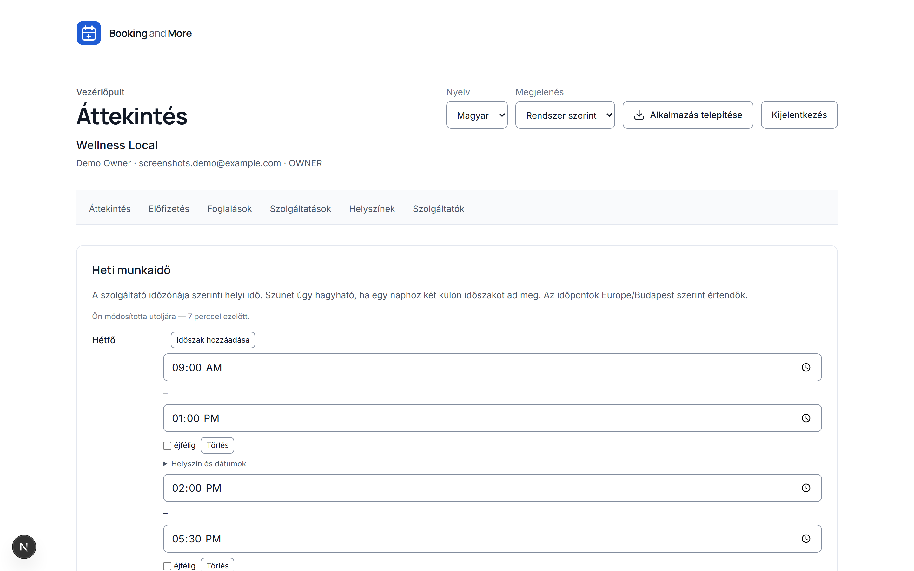

**Adj hozzá egy második időszakot egy naphoz, hogy szünetet hagyj a közepén** — a 09:00–12:30 és 13:30–17:00 egy olyan ebédidőt ad, amire senki nem tud foglalni. Az az nap, amelyiken nincs időszak, egyszerűen zárva van.

Az időpontok **helyi idők a szolgáltató saját zónájában**, és a képernyő megmutatja, melyik ez a zóna. Ez évente kétszer számít: a "Hétfőnként 09:00–17:00" 09:00–17:00 marad azon a hétfőn is, amikor átállítják az órákat, pontosan úgy, ahogy egy ember elvárná.

Minden időszak tovább szűkíthető:

- **Helyszín** — hol dolgozik ebben az időszakban, vagy _"Bárhol, ahol dolgozik"_
- **Szolgáltatás** — az időszak korlátozása egy szolgáltatásra, vagy hagyd _"Minden szolgáltatás"_-ra
- **Ettől dátumtól / eddig a dátumig** — egy időszak, ami csak az év egy részére érvényes

### Kivételek — egyszeri változtatások

A képernyő alsó fele azokat a dolgokat kezeli, amiket egy heti minta nem tud kifejezni. **A kivételek felülírják a heti munkarendet.**

- **Nem elérhető** — egy zárás. Ünnepnapok, egy képzési nap, egy délután a fogorvosnál.
- **Extra elérhetőség** — a szokásos mintán kívüli nyitás. Egy szombati rendelés, egy késő esti alkalom.

Adj hozzá **indoklást**, ha segít a csapatodnak; az indoklások **csak a személyzetnek szólnak, az ügyfelek soha nem látják**.

Ha egy olyan időpontot választasz, amit a nyári időszámítás "elnyelt", a képernyő szól róla ahelyett, hogy csendben találgatna: _"Ez az időpont nem létezik azon a napon — az órákat előreállítják."_ És visszafelé: _"Ez az időpont kétszer fordul elő azon a napon."_

### Két biztonsági háló, amit érdemes ismerned

**Az új munkarenden kívülre eső foglalások.** Ha lerövidítesz egy hetet, amiben már vannak foglalások, a mentés nem hiúsul meg — megáll, és pontosan megmutatja, mely foglalások esnek most a munkarenden kívülre:

> _Ezek a foglalások továbbra is érvényesek, és megtartják az időpontjukat. A mentés nem mondja le és nem mozgatja őket — csak azt jelenti, hogy a munkarend már nem fedi le őket._
> _Senkinek nem küldünk erről e-mailt. Ha egy foglalást mozgatni vagy lemondani kell, azt a Foglalások képernyőről tedd._

Nyomd meg a **Mentés mindenképp** gombot a folytatáshoz, vagy a **Vissza** gombot az átgondoláshoz. Figyelmeztet, nem tiltja — mert az alternatíva, vagyis a munkarend módosításának megtagadása, arra kényszerítene, hogy valódi ügyfeleket mondj le csak azért, hogy szerkeszthesd a munkarendet.

**Ha valaki más szerkeszti ugyanazt a naptárt.** Ha egy szolgáltató és az asszisztense egyszerre nyitja meg ugyanazt a hetet, a másodikként mentő ezt az üzenetet kapja:

> _{név} mentette ezt a munkarendet {mikor}, amíg te szerkesztetted. Semmi, amit begépeltél, nem lett elmentve._

Semmi sem íródik felül csendben. Az **Aktuális verzió betöltése** lecseréli a képernyőn lévőt — előbb másold ki, amire még szükséged van. A képernyő tetején egy halvány sor azt is megmutatja, ki és mikor módosította legutóbb ezt a munkarendet.

---

## Bejelentkezés adása a csapatodnak

Kétféle módon kaphat valaki hozzáférést, és fontos a megfelelőt választani.

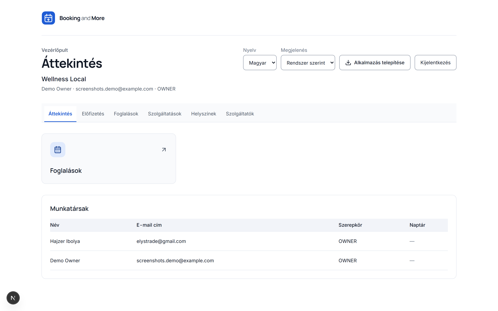

### Szolgáltató meghívása

**Szolgáltatók képernyő → a szolgáltató sora → Meghívás.**

Ha innen csinálod, **a meghívó magával viszi a naptárát is**. E-mailben küldünk nekik egy egyszer használatos linket; ők választanak jelszót — mi soha nem küldünk egyet. Miután elfogadták:

> _Ez a naptár az övék lesz: beállíthatják a munkarendjüket, felvehetnek szabadidőt, és láthatják a saját foglalásaikat._

Egy e-mail cím nélküli szolgáltatót nem lehet meghívni; adj hozzá előbb egyet a rekordjához. Ha már van egy élő meghívó folyamatban, a képernyő figyelmeztet, hogy egy újabb elküldése leállítja az első linket.

### Mindenki más meghívása

**Irányítópult áttekintés → Meghívás valakinek.** Ezt használd adminisztrátorokhoz és recepciós személyzethez.

Ha az illető, akit meghívsz, **szolgáltató**, ne ezt az utat használd — az irányítópult visszairányít a Szolgáltatók képernyőre, mert az innen küldött meghívó naptár nélkül érkezik, egy naptár nélküli szolgáltató pedig nem tudja végezni a munkáját.

---

## Ki mit tehet

Négy szerepkör. Mindegyik egy **tagsághoz** tartozik — vagyis egy adott személyhez _egy adott vállalkozásban_. Ugyanaz a személy lehet az egyik klinika tulajdonosa, és asszisztenskedhet egy másiknál, teljesen más jogosultságokkal mindkét helyen.

|                                            | Tulajdonos | Adminisztrátor | Szolgáltató | Asszisztens |
| ------------------------------------------- | :--------: | :------------: | :---------: | :---------: |
| Számlázás és előfizetés                  |     ✅     |       —       |     —      |     —      |
| Vállalkozási beállítások                 |     ✅     |       —       |     —      |     —      |
| Tagok meghívása és kezelése               |     ✅     |       ✅       |     —      |     —      |
| Szolgáltatások, helyszínek, szolgáltatók |     ✅     |       ✅       |     —      |     —      |
| **Bárki** munkarendjének szerkesztése   |     ✅     |       ✅       |     —      |     —      |
| **Saját** munkarend szerkesztése        |     ✅     |       ✅       |     ✅     |     —      |
| **Átruházott** naptár szerkesztése       |     —     |       —       |     —      |     ✅     |
| **Minden** foglalás megtekintése/kezelése |     ✅     |       ✅       |     —      |     —      |
| **Saját** foglalások megtekintése/kezelése |     ✅     |       ✅       |     ✅     |     —      |
| **Átruházott** foglalások megtekintése/kezelése |     —     |       —       |     —      |     ✅     |
| **Eldönti, ki segít egy naptárnál**     |     ✅     |       —       |     —      |     —      |

Két sor van ebben a táblázatban, amin érdemes elgondolkodni.

**Egy adminisztrátor szerkesztheti a klinika minden munkarendjét, mégsem döntheti el, ki segít egy adott naptárnál.** Ez a hiányosság szándékos. Egy naptár szerkesztése egy napi feladat; a hozzá tartozó kulcsok átadása munkaerő-gazdálkodási döntés, ez pedig a tulajdonosé.

**Egy asszisztens csak azokhoz a naptárakhoz fér hozzá, amiket megkapott, máshoz nem.** Nem "minden foglaláshoz" — csak a konkrét naptárakhoz, amiket valaki átadott neki. Amíg nem kapott egyet, a Foglalások képernyője üres, és az oldalsáv meg sem jeleníti. Ez nem hiba; a recepció pontosan azzal a hozzáféréssel rendelkezik, amit megkapott.

> **Az oldalsávad csak azt mutatja, amit ténylegesen tudsz használni.** Azok a képernyők, amikhez nincs jogosultságod, nem szerepelnek a listában, és azok sem, amik üresek lennének — a Foglalások naptár nélkül, az Elérhetőség saját naptár nélkül. Ha valaki azt mondja, hogy egy képernyő "hiányzik", az általában egy még hozzá nem rendelt naptárt jelent.

---

## Naptár megosztása — átruházás

A recepciódnak azokat a naptárakat kell látnia, amiket kezel, és csakis azokat. Erre való az átruházás.

**Csak a tulajdonos teheti meg.** Nyisd meg egy szolgáltató **Elérhetőség** képernyőjét, és nyomd meg a **Segítők** gombot.

> _Azok, akik ennél a naptárnál segítenek. Te választod ki, kik ők, és mit tehetnek meg._

Nyomd meg a **Segítő hozzáadása** gombot, válassz egy tagot, és pipáld be, mit tehet meg:

| Hatáskör            | Mit ad nekik                                                     |
| --------------------- | -------------------------------------------------------------------- |
| **Elérhetőség**    | Munkarend beállítása és szabadidő felvétele ennél a naptárnál       |
| **Foglalások**      | Ennek a naptárnak a foglalásainak megtekintése, elfogadása, átütemezése és lemondása |

Pipálj be legalább egyet — egy segítőnek kell legalább egy hatáskör. A hozzáférés teljes megszüntetéséhez használd a **Visszavonás** gombot; a következő műveletüknél elveszítik a jogosultságot.

### Meghívás valakinek, akinek még nincs fiókja

Nincs szükség kétlépéses táncra. Nyomd meg az **Új személy meghívása** gombot, add meg az e-mail címet, és a meghívó magával viszi a naptár-hozzárendelést is. Amikor elfogadják, egyszerre kapják meg a tagságukat és a naptárukat — így soha nem landolnak egy üres irányítópulton, tanácstalanul.

Egy e-mail cím **egy időben egy élő meghívót tarthat vállalkozásonként**. Ha ugyanazt a személyt meghívod egy második naptárhoz, az újabb meghívó felülírja az elsőt.

**Egy asszisztens több naptárat is birtokolhat**, ami pontosan az, amire egy négy szolgáltatót lefedő recepciónak szüksége van.

Egy szolgáltató mindig láthatja, ki segít a saját naptáránál — csak nem változtathatja meg. A képernyője erre utal: _"A vállalkozás tulajdonosa dönti el, ki — kérd meg, hogy változtasson rajta."_

---

## A foglalási oldalad — amit az ügyfelek látnak

Az oldalad a vállalkozásod saját címén él, és fiókot nem igényel. Öt lépés:

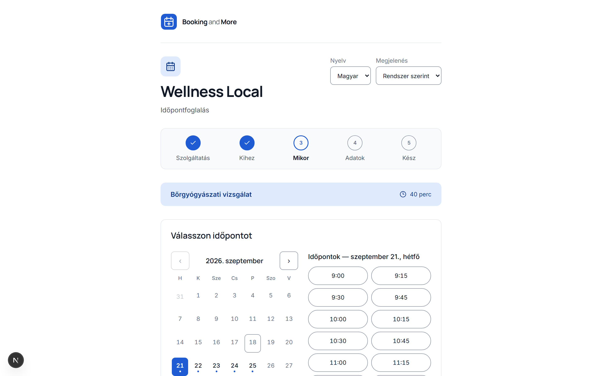

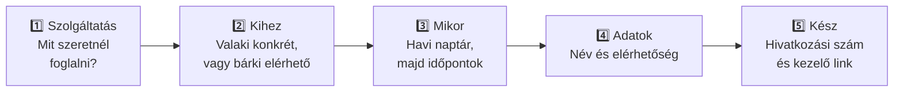

**1. lépés — Szolgáltatás.** Minden, amit aktívra állítottál, az időtartamával és árával. Az ár nélküli szolgáltatásoknál ez áll: _"Ár megkérdezésre"_. A jóváhagyást igénylő szolgáltatás így van jelölve: _"a klinika visszaigazolja"_, hogy senkit ne érjen később meglepetés.

**2. lépés — Kihez.** A foglalható szolgáltatóid, plusz a **"Bárki elérhető"** — amit a legtöbben választanak, és ami az egész csapatod összes szabad időpontját megnyitja.

**3. lépés — Mikor.** Egy havi naptár. Minden nap megmutatja, hány szabad időpont van, így egy üres nap már kattintás előtt is látszik, nem csak utána. Ha egy hónap üres, az oldal nem akad el — előre néz, és felajánlja a **legközelebbi elérhető** napot, akár hónapokkal később is. Csak akkor javasolja a közvetlen kapcsolatfelvételt, ha valóban semmi sincs.

**4. lépés — Adatok.** Név, e-mail, telefonszám, és bármi, amit tudnod kell. Az e-mail vagy a telefonszám kötelező — legalább egy módon el kell tudni érni őket.

**A kiválasztott időpont fenntartásra kerül, amíg gépelnek.** _"Ez az időpont fenn van tartva eddig: {idő}"_ — körülbelül öt percig. Ez megakadályozza, hogy két ember töltse ki ugyanazt az űrlapot ugyanarra az időpontra. Ha lejár a fenntartás, újra kell választaniuk, és ha valaki más hamarabb véglegesíti, egyértelműen tájékoztatást kapnak — _"Valaki éppen most foglalta le azt az időpontot"_ —, és megmutatjuk, mi még szabad, ahelyett hogy visszadobnánk őket a legelejére.

**5. lépés — Kész.** Egy hivatkozási szám és egy link a foglalás kezeléséhez. Ha a szolgáltatás jóváhagyást igényel, ehelyett ez áll: _"A klinika hamarosan visszaigazolja ezt az időpontot"_.

> A kezelő link az **egyetlen** módja, hogy az ügyfél online módosítsa a foglalást. Az e-mailjükben is szerepel — de az oldal nem véletlenül írja azt: _"Mentsd el ezt a linket"_. Csak egy titkosított változatát tároljuk, így ha elveszik, nem állítható vissza vagy küldhető újra; ilyenkor a foglalást a személyzetnek kell módosítania.

### Amit az ügyfél tehet ezzel a linkkel

A megnyitásakor látja a foglalását — állapot, időpont, hely, szolgáltatás, szolgáltató, ár —, és két műveletet:

- **Időpont módosítása.** Új időpontot javasolnak, és az oldal ellenőrzi, mielőtt véglegesítené: _"Ez az időpont áthelyezhető erre: {idő}."_ Ha nem lehetséges, azt a tanácsot kapják, hogy hívjanak fel téged ahelyett, hogy találgatnának.
- **Lemondás.** Egyértelmű figyelmeztetéssel, hogy ezzel felszabadítja az időpontot másnak, és nem vonható vissza.

Egy már lemondott vagy megtörtént időpont lezárt, és az oldal ezt jelzi, ahelyett hogy olyan gombokat kínálna, amik úgyis meghiúsulnának.

---

## Amit az ügyfelek e-mailben kapnak

Öt e-mail, mind az ügyfél saját nyelvén:

| E-mail                        | Mikor                                                | Tartalmaz kezelő linket?           |
| ------------------------------ | ------------------------------------------------------ | ----------------------------------- |
| **Foglalás kérve**           | Azonnal, jóváhagyást igénylő szolgáltatásnál          | ✅                                 |
| **Foglalás visszaigazolva** | Visszaigazoláskor, vagy amikor a személyzet elfogadja a kérést | ✅ (plusz _Hozzáadás a Google Naptárhoz_) |
| **Foglalás módosult**        | Amikor változik az időpont                            | —                                  |
| **Foglalás lemondva**        | Amikor lemondásra kerül                                | —                                  |
| **Emlékeztető**               | 24 órával az időpont előtt                            | —                                  |

A visszaigazoló e-mail tartalmaz egy **Hozzáadás a Google Naptárhoz** gombot. Ez egy egykattintásos előkitöltés — nem köt össze semmit a rendszereddel, és szándékosan csak a visszaigazoló e-mailen szerepel: ha egy átütemezési e-mailre kerülne, egy _második_ bejegyzést adna valaki naptárához ahelyett, hogy a már meglévőt mozgatná.

A **lemondási feltételeidet**, ha beállítottál ilyet, pontosan úgy nyomtatjuk ki a visszaigazoláson, ahogyan megírtad.

---

## A nap irányítása — a Foglalások képernyő

**Irányítópult → Foglalások.** Ezen a képernyőn él a csapatod.

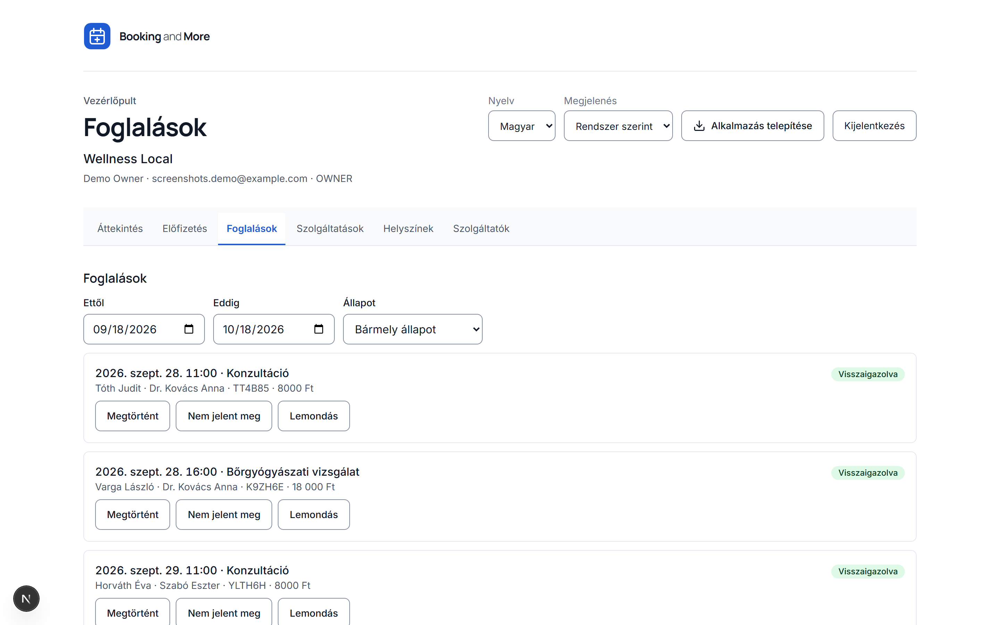

Szűrj **dátumtartomány**, **szolgáltató** — _"Mindenki"_, vagy _"Az összes szolgáltatóm"_, ha asszisztensként több naptárhoz is hozzáférsz — és **állapot** szerint.

| Állapot                     | Jelentése                                     |
| ----------------------------- | ------------------------------------------------ |
| **Jóváhagyásra vár**       | Egy kérés egy jóváhagyást igénylő szolgáltatásra |
| **Visszaigazolva**          | Megy tovább                                       |
| **Lemondva**                | Törölve                                          |
| **Megtörtént**              | Megtörtént                                        |
| **Nem jelent meg**          | Nem jött el                                       |
| **Lejárt**                  | Egy soha be nem fejezett fenntartás              |

Négy művelet minden sorban: **Elfogadás** (egy kérésből visszaigazolt időpontot csinál, és e-mailt küld az ügyfélnek), **Megtörténtnek jelölés**, **Nem jelent meg jelölés**, és **Lemondás**.

Figyeld a **Munkarenden kívül** jelzést. Azt jelzi, hogy egy időpont már nem esik a szolgáltató munkarendjébe, vagy éppen szabadidő alá esik. Az időpont továbbra is valós, és megtartja a helyét — a jelzés csak azt mondja, hogy a munkarend megváltozott alatta, és valakinek döntenie kell, mi legyen.

---

## Nyelvek és időzónák

**Két felületi nyelv:** magyar és angol. Mindenki a saját nyelvét választja a nyelvváltóból — ez senki másnak nem változtat semmit. Az ügyfeleid a foglalási oldalt és minden e-mailt azon a nyelven kapják, amelyen a vállalkozásodat beállítottuk.

A szolgáltatók emellett rögzíthetik a **beszélt nyelveiket** — magyar, angol, német vagy francia —, hogy segítsék az ügyfelek választását.

**Az időzónákkal kapcsolatban** két szabály tartja rendben a dolgokat:

- **A munkarend falióra szerinti.** A "Hétfőnként 09:00–17:00" 09:00–17:00 marad egy nyári időszámítás-váltás után is.
- **Egy konkrét időpont egy pillanat az időben.** Egy másik országban lévő ügyfél a saját órájára átváltva, helyesen látja, mindkét irányban.

Ezen soha nem kell gondolkodnod — de ezért mondja meg az elérhetőség képernyő, melyik zónában gépelsz éppen.

---

## Amikor a foglalási oldal semmit nem mutat

A leggyakoribb támogatási kérdés, és szinte mindig néhány egyszerű oknak köszönhető. Haladj végig ezen a listán:

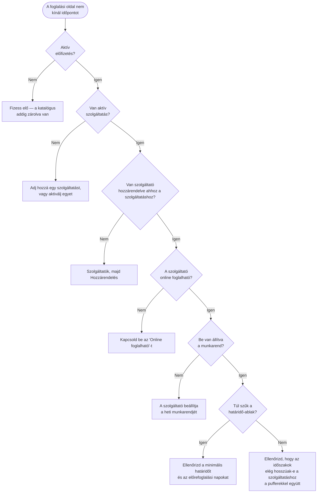

A két leggyakoribb hiba:

**Egy szolgáltató munkarenddel, de hozzárendelt szolgáltatás nélkül.** A naptára tökéletesen beállítottnak tűnik, mégsem lehet hozzá foglalni, mert egy foglalás mindig _egy szolgáltatásra_ szól. Javítsd a **Hozzárendelés** gombbal a sorában.

**A szolgáltatás plusz pufferei hosszabbak a munkaidő-szakasznál.** Egy 30 perces szolgáltatás 10 perces pufferrel mindkét oldalon 50 perces ablakot igényel. Egy 09:00–09:45 időszak nagyvonalúnak tűnik, mégsem fér bele semmi.

Ha egy szolgáltatás **foglalható ennyi napra előre** beállítása nagyon alacsony, a képernyő azonnal figyelmeztet: _"Csak a következő {n} nap lesz foglalható"_ — mert ezt könnyű elgépelni.

---

## Egy értelmes sorrend minden beállításához

1. **Fogadd el a meghívódat**, és válassz jelszót.
2. **Fizess elő** — válassz csomagot, kövesd az e-mailben kapott fizetési linket, indítsd el a próbaidőszakot.
3. **Add hozzá a szolgáltatásaidat** — időtartam, pufferek, ár, és hogy melyik igényel jóváhagyást.
4. **Add hozzá a helyszíneidet** — hagyd ki teljesen, ha csak online vagy telefonon dolgozol.
5. **Add hozzá a szolgáltatóidat**, és **rendeld hozzájuk** a szolgáltatásaikat. Ezt ne hagyd ki.
6. **Hívd meg a szolgáltatóidat** a soraikból, hogy minden meghívó magával vigye a naptárukat.
7. **Minden szolgáltató beállítja a munkarendjét** az Elérhetőség képernyőn.
8. **Hívd meg a recepciódat**, és **ruházd át** a náluk lévő naptárakat.
9. **Nyisd meg saját magad a foglalási oldalt**, és foglalj le egy próba-időpontot elejétől végig.
10. **Oszd meg a linket** — a weboldaladon, az e-mail aláírásodban, a bejáratodon.

---

## Jó szokások

- **Archiválj, ne hozz létre újra.** Ha egy nevet elutasít a rendszer, pipáld be az _Archiváltak megjelenítése_ opciót, és állítsd vissza inkább — így az időpont-előzményeid helyesek maradnak.
- **A puffereket a szolgáltatáson add meg, ne az időtartamban.** Az ügyfélnek az időpontja valódi hosszát kell látnia; a takarítási idő a tiéd.
- **Hagyd, hogy a szolgáltatók maguk kezeljék a munkarendjüket.** Ők tudják, mikor vannak távol, és a képernyő nekik lett megtervezve.
- **Szűken ruházz át.** Add meg a recepciónak a _Foglalások_ hozzáférést azokhoz a naptárakhoz, amiket kezelnek. Az _Elérhetőség_ hozzáférést csak ott add hozzá, ahol valóban kezelik valaki munkarendjét.
- **Ellenőrizd a Munkarenden kívül jelzést** minden munkarend-változtatás után. Ez az egyetlen dolog, amiről senkinek nem küldünk e-mailt.
- **Tesztelj egy valódi foglalással**, mielőtt megosztanád a linket. Öt perc, és mindent elkap a fentiek közül.
