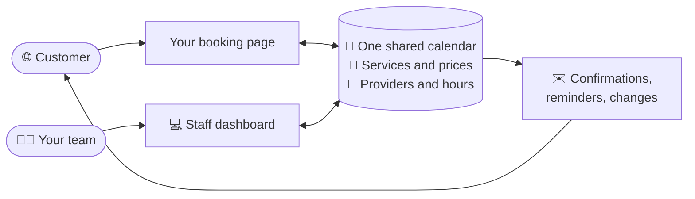
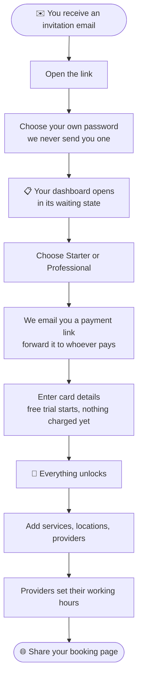
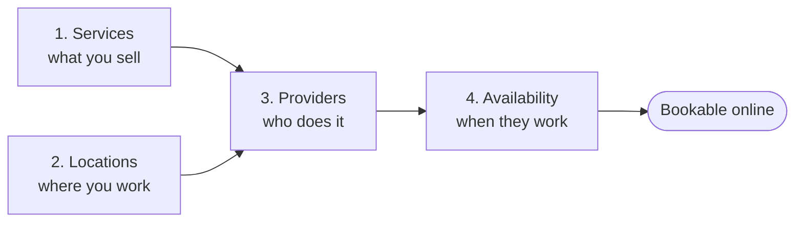
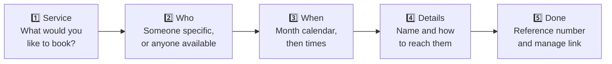
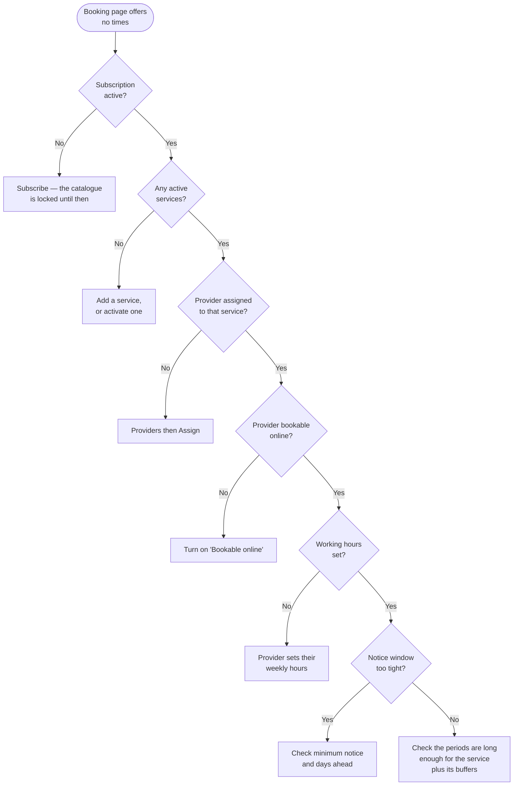

# booking-and-more — User Guide

_A plain-English guide to running your business on booking-and-more: what each screen does, who is allowed to do what, and how an appointment travels from your customer's phone to your team's day._

---

## What is this, in one sentence?

It's **your own online booking page, backed by a dashboard where your team manages the calendar** — so customers book themselves in at two in the morning and your staff keep full control of who is available, when, and for what.

Every business on the platform is kept entirely separate from every other: your services, your people, your locations, your customers. Nobody else can see them.

It is built for **clinics, salons and studios** — anywhere people book time with a named person for a named service.

---

## The two halves of the product

### 1. Your public booking page 🌐

A page at your own address — `yourbusiness.example.com/your-slug/book` — that anyone can open without an account. In five short steps they choose a service, choose who they want to see, pick a time from a real calendar, leave their details, and they're booked. They get an email straight away with a link they can use to change or cancel.

### 2. The staff dashboard 💻

Where your team signs in. It holds the catalogue you sell (services, people, places), each provider's working hours, and the day-to-day list of appointments. Your team accepts requests, reschedules, cancels, and marks people as arrived or missed.

Both halves read the same calendar, so there is never a second diary to keep in step.

---

## Getting started — how you got here

booking-and-more is not something you sign up for on your own. **We set your organization up for you and email you an invitation.** That is deliberate: it means your business name, your web address and your language are right from the very first screen you see.

Here is the whole path from that email to a working booking page:

### The invitation

The link in that email is **single-use and time-limited**. Open it, pick a password, and you are in — you become the **owner** of the organization.

If you are already signed in as somebody else when you open it, the screen will say so plainly and offer to sign you out first. If the link has gone stale, ask us to resend it; a fresh one is issued in seconds and the old one stops working.

### The waiting state

Before your subscription starts, your dashboard shows a short welcome screen instead of the full product:

> **Welcome to {your organization}**
> Your organization is set up and waiting for its subscription. Here is what happens next.

It lists the three steps ahead — subscribe, configure, take bookings — and counts down the days you have left to subscribe. **Providers, services, locations, availability and bookings stay locked until the subscription starts.** Only two screens work: this overview, and Subscription, which is the one that resolves it.

---

## Your subscription

Open **Subscription** in the sidebar. You will see two plans:

| Plan             | What it's for                                         |
| ---------------- | ----------------------------------------------------- |
| **Starter**      | Smaller businesses getting their bookings online      |
| **Professional** | Busier operations with more providers and more volume |

Choose one and press **Send me the payment link**. We email a secure payment page to your address — you can forward it to whoever handles the money, which is why it arrives by email rather than opening straight away.

### The free trial

New organizations get **30 days free**. We take your card at the start but **charge nothing until the trial ends**, and you can cancel any time before then. The screen tells you exactly when: _"Your free trial ends on {date}. We will then charge for {plan}."_

An organization only gets one trial. If yours has already been used, the screen says so and billing starts immediately instead.

### Once you are subscribed

The Subscription screen becomes your billing home:

- **Manage billing** opens a secure portal where you change your card, download invoices, or cancel. You are brought straight back afterwards.
- **Changing plan** — an upgrade takes effect immediately; a downgrade is scheduled, and the screen tells you the date: _"Your plan changes to {plan} on {date}."_
- **Cancelling** doesn't cut you off mid-month. The screen switches to _"Ends on {date}"_, and you can restart any time before then.
- **A failed payment** does not switch anything off straight away. You'll see a notice asking you to update your card while your service keeps running.

---

## Building your catalogue

Three screens, and the order matters. **Services first, then locations, then providers** — because a provider is booked _for a service_, so a provider created first has nothing to offer and cannot appear on your booking page at all.

---

## Services — what you sell

**Dashboard → Services → Add a service.**

A service is one bookable thing: a check-up, a cut and colour, a 50-minute session.

| Field                        | What it does                                                                                                                      |
| ---------------------------- | --------------------------------------------------------------------------------------------------------------------------------- |
| **Name** and **Description** | What the customer reads on the booking page                                                                                       |
| **Duration**                 | How long the appointment is — **this is what the customer sees**                                                                  |
| **Buffer before / after**    | Extra minutes reserved around the appointment. **Customers never see them** — use these for cleaning down a room or writing notes |
| **Price**                    | Leave it blank and the booking page says _"On request"_ instead                                                                   |
| **URL name**                 | Appears in your booking links. Leave it blank and we build one from the name                                                      |

### The three settings worth understanding

**Needs approval before it is confirmed.** Turn this on and bookings arrive as _requests_ rather than confirmed appointments. The customer is told the business will confirm shortly, and the appointment waits on your Bookings screen until somebody presses Accept. Use it where you want to vet who's coming in; leave it off where you're happy to be booked automatically.

**Minimum notice (minutes).** How close to the appointment somebody may still book. Set it to 120 and nobody can grab a slot less than two hours out.

**Book up to (days ahead).** How far into the future your calendar is open.

Both of the last two can be left blank to **inherit** the business-wide setting. Careful: _blank_ and _zero_ are different. Blank means "use the default"; zero means "bookable up to the very last second". The screen tells you which default you're inheriting, and warns you if you've set a window so short that customers will see almost nothing.

### Turning things off

Two different questions, and both are available:

- **Deactivate** — off for now. It stops appearing on the booking page and can be switched back on any moment.
- **Archive** — gone. It disappears from the working list entirely.

**Nothing is ever really deleted.** Old appointments keep pointing at the service they were booked for, so your history stays intact and correctly priced. Tick **Show archived** to see archived rows, and **Restore** to bring one back. If you try to create something and are told the name is taken, it's usually an archived row — restore it rather than making a duplicate.

---

## Locations — where you work

**Dashboard → Locations → Add a location.**

A location is one of your sites. There are four kinds:

| Type           | Use it for                             |
| -------------- | -------------------------------------- |
| **In person**  | A physical address customers travel to |
| **Online**     | Video appointments                     |
| **Home visit** | You travel to them                     |
| **Telephone**  | Phone consultations                    |

For physical sites, fill in the address, postal code, city and country. **Map coordinates** are optional and let the booking page point at the right spot.

**Time zone** deserves a note: leave it blank and the location uses your business's own zone. Set it only if you genuinely run a site in another zone — appointments there are then shown in that zone.

> **You may not need any locations at all.** If everything you do is online or by telephone, skip this screen entirely. Locations describe where a person physically works; they are not required for a booking to happen.

---

## Providers — the people customers book

**Dashboard → Providers → Add a provider.**

A provider is somebody appointments are booked with. Note that **creating a provider does not give them a login** — that's a separate step, covered further down.

| Field                  | What it does                                                                                             |
| ---------------------- | -------------------------------------------------------------------------------------------------------- |
| **Name, Email, Phone** | Their record. The email is also what an invitation would be sent to                                      |
| **Languages spoken**   | Hungarian, English, German, French — shown to help customers choose                                      |
| **Bookable online**    | Turn this **off** to keep somebody off the public booking page while your team still books them by phone |
| **Default location**   | Where they normally work                                                                                 |

### Assigning services

This is the step people forget. **Until a provider is assigned at least one service, nobody can book them** — they simply will not appear on your booking page.

Use **Assign** on the provider's row to tick the services they offer. While you're there, you can override the service's own settings for this one person:

- **Duration** — leave blank to use the service's own. Set it if this provider takes 45 minutes where everyone else takes 30.
- **Price** — leave blank to inherit. (If the service has no price at all, there's nothing to override, and the screen says so.)

**Assign** is also where you add further locations beyond their default, so a provider can work Tuesdays at one site and Thursdays at another.

---

## Availability — when people work

**Availability belongs to the provider.** That is a deliberate decision, not an accident of the layout: the owner decides what the business sells and where, and each provider decides when they work.

So there is no organization-wide availability screen. A provider with a login opens **Availability** and sees their own diary. An owner or administrator reaches one diary at a time, from that provider's row on the Providers screen.

### Weekly working hours

The top half of the screen is an ordinary week. For each day, add one or more periods.

**Add a second period to a day to leave a break in the middle** — 09:00–12:30 and 13:30–17:00 gives you a lunch hour that nobody can book into. A day with no periods is simply closed.

Times are **local times in the provider's own zone**, and the screen tells you which zone that is. This matters twice a year: "Mondays 09:00–17:00" stays 09:00–17:00 on the Monday the clocks change, exactly as a human would expect.

Each period can be narrowed further:

- **Location** — where this period is worked, or _"Wherever they work"_
- **Service** — restrict a period to one service, or leave it as _"Every service"_
- **From date / Until date** — a period that only applies for part of the year

### Exceptions — one-off changes

The bottom half handles the things a weekly pattern can't express. **Exceptions override the weekly hours.**

- **Unavailable** — a closure. Holidays, a training day, an afternoon at the dentist.
- **Extra availability** — an opening outside the normal pattern. A Saturday clinic, a late evening.

Add a **reason** if it helps your team; reasons are **staff-only and never shown to customers**.

If you pick a time that daylight saving has eaten, the screen tells you rather than guessing silently: _"That time does not exist on that date — the clocks go forward."_ And on the way back: _"That time happens twice on that date."_

### Two safety nets you should know about

**Bookings that fall outside the new schedule.** If you shorten a week that already has appointments in it, saving does not fail — it stops and shows you exactly which appointments now sit outside the hours:

> _These appointments still stand and still hold their slot. Saving does not cancel or move them — it only means the schedule no longer covers them._
> _Nobody is emailed about this. If an appointment needs to move or be cancelled, do that from the Bookings screen._

Press **Save anyway** to go ahead, or **Go back** to rethink. It warns rather than refuses, because the alternative — refusing to let you change your hours — would force you to cancel real customers just to edit a schedule.

**Somebody else editing the same diary.** If a provider and their assistant open the same week at once, the second one to save is told:

> _{name} saved this schedule {when}, while you were editing it. Nothing you typed has been saved._

Nothing is silently overwritten. **Reload their version** replaces what's on screen — so copy anything you still need first. The screen also shows a quiet line at the top telling you who last changed this schedule and when.

---

## Giving your team logins

There are two different ways somebody gets access, and picking the right one matters.

### Inviting a provider

**Providers screen → the provider's row → Invite.**

Do it from here, and **the invitation carries their diary with it**. We email them a single-use link; they choose their own password — we never send one. Once they accept:

> _This diary becomes theirs: they can set their working hours, add time off, and see their own bookings._

A provider without an email address on file can't be invited; add one to their record first. If there's already a live invitation outstanding, the screen warns you that sending another will stop the first link working.

### Inviting everyone else

**Dashboard overview → Invite someone.** Use this for administrators and front-desk staff.

If the person you're inviting is a **provider**, don't use this route — the dashboard will point you back to the Providers screen, because an invitation sent from here arrives without a diary attached, and a provider with no diary can't do their job.

---

## Who can do what

Four roles. Each belongs to a **membership** — that is, to a person _in one particular business_. The same person can own one clinic and assist at another, with completely different powers in each.

|                                       | Owner | Administrator | Provider | Assistant |
| ------------------------------------- | :---: | :-----------: | :------: | :-------: |
| Billing and subscription              |  ✅   |       —       |    —     |     —     |
| Business settings                     |  ✅   |       —       |    —     |     —     |
| Invite and manage members             |  ✅   |      ✅       |    —     |     —     |
| Services, locations, providers        |  ✅   |      ✅       |    —     |     —     |
| Edit **anyone's** working hours       |  ✅   |      ✅       |    —     |     —     |
| Edit **their own** working hours      |  ✅   |      ✅       |    ✅    |     —     |
| Edit a **delegated** diary's hours    |   —   |       —       |    —     |    ✅     |
| See and manage **all** bookings       |  ✅   |      ✅       |    —     |     —     |
| See and manage **their own** bookings |  ✅   |      ✅       |    ✅    |     —     |
| See and manage **delegated** bookings |   —   |       —       |    —     |    ✅     |
| **Decide who assists on a diary**     |  ✅   |       —       |    —     |     —     |

Two lines in that table are worth pausing on.

**An administrator can edit every schedule in the clinic and still cannot decide who assists on a diary.** That gap is intentional. Editing a diary is a day's work; handing somebody else the keys to it is a staffing decision, and staffing is the owner's.

**An assistant reaches the diaries they have been given, and no others.** Not "all bookings" — the specific diaries somebody handed them. Until they've been given one, their Bookings screen is empty, and the sidebar won't even show it. That isn't a bug; it's the front desk having exactly the access it was granted.

> **Your sidebar shows only what you can actually use.** Screens you have no permission for aren't listed, and screens that would be empty — Bookings with no diary, Availability with no diary of your own — aren't listed either. If somebody says a screen is "missing", it's usually a diary that hasn't been assigned yet.

---

## Sharing a diary — delegation

Your front desk needs to see the diaries they cover, and only those. That's what delegation does.

**Only the owner can do this.** Open a provider's **Availability** screen and press **Delegates**.

> _People who assist on this diary. You choose who, and what each of them may do._

Press **Add a delegate**, choose a member, and tick what they may do:

| Scope            | What it gives them                                           |
| ---------------- | ------------------------------------------------------------ |
| **Availability** | Set working hours and book out time off on this diary        |
| **Bookings**     | See, accept, reschedule and cancel this diary's appointments |

Tick one or both — a delegate needs at least one. To remove access entirely, use **Revoke**; they lose it on their next action.

### Inviting somebody who has no account yet

You don't need a two-step dance. Press **Invite someone new**, enter an email address, and the invitation carries the diary assignment with it. When they accept, they get their membership and their diary in the same moment — so they never land on an empty dashboard wondering what went wrong.

One address can hold **one live invitation per business** at a time. Invite the same person for a second diary and the newer invitation supersedes the first.

**One assistant can hold several diaries**, which is exactly what a front desk covering four providers needs.

A provider can always see who assists on their own diary — they just can't change it. Their screen says so: _"The organization owner decides who — ask them to change it."_

---

## Your booking page — what customers see

Your page lives at your business's own address and needs no account. Five steps:

**Step 1 — Service.** Everything you've marked active, with its duration and price. Services with no price show _"On request"_. A service needing approval is labelled _"confirmed by the clinic"_ so nobody is surprised later.

**Step 2 — Who.** Your bookable providers, plus **"Anyone available"** — which is what most people choose, and which opens up every free slot across your whole team.

**Step 3 — When.** A month calendar. Each day shows how many times are free, so an empty day is visible before it's clicked rather than after. If a month is empty, the page doesn't dead-end — it looks ahead and offers the **next available** day, even if that's months out. Only if there's genuinely nothing does it suggest contacting you directly.

**Step 4 — Details.** Name, email, phone, and anything you should know. Email or phone is required — at least one way to reach them.

**The chosen time is held while they type.** _"This time is reserved for {time}"_ — about five minutes. It stops two people filling in the same form for the same slot. If the hold runs out they're asked to pick again, and if somebody else confirms first they're told plainly — _"Somebody just took that time"_ — and shown what's still free rather than being dumped back at the start.

**Step 5 — Done.** A reference number and a link to manage the booking. If the service needs approval, this reads _"The clinic will confirm this appointment shortly"_ instead.

> The manage link is the **only** way a customer changes a booking online. It's in their email too — but the page says _"Save this link"_ for a reason. We store only a scrambled version of it, so if it's lost, it cannot be recovered or resent; the appointment has to be changed by your staff instead.

### What the customer can do with that link

Opening it shows their appointment — status, when, where, service, provider, price — and two actions:

- **Change the time.** They propose a new time and the page checks it before committing: _"This appointment can move to {time}."_ If it can't, they're told to call you rather than left guessing.
- **Cancel.** With a clear warning that it frees the time for somebody else and cannot be undone.

An appointment that is already cancelled or completed is settled, and the page says so instead of offering buttons that would fail.

---

## What customers receive by email

Five emails, all in the customer's own language:

| Email                 | When                                            | Carries a manage link?             |
| --------------------- | ----------------------------------------------- | ---------------------------------- |
| **Booking requested** | Immediately, for a service that needs approval  | ✅                                 |
| **Booking confirmed** | On confirmation, or when staff accept a request | ✅ (plus _Add to Google Calendar_) |
| **Booking changed**   | When the time moves                             | —                                  |
| **Booking cancelled** | When it's cancelled                             | —                                  |
| **Reminder**          | 24 hours before the appointment                 | —                                  |

The confirmation email carries an **Add to Google Calendar** button. It's a one-tap prefill — it doesn't connect anything to your system, and it's deliberately only on the confirmation: putting it on a reschedule email would add a _second_ entry to somebody's calendar rather than moving the one already there.

Your **cancellation policy**, if you've set one, is printed on the confirmation exactly as you wrote it.

---

## Running the day — the Bookings screen

**Dashboard → Bookings.** This is the screen your team lives in.

Filter by **date range**, by **provider** — _"Everyone"_, or _"All my providers"_ if you're an assistant with several diaries — and by **status**.

| Status                | Meaning                                     |
| --------------------- | ------------------------------------------- |
| **Awaiting approval** | A request on a service that needs approving |
| **Confirmed**         | Going ahead                                 |
| **Cancelled**         | Called off                                  |
| **Completed**         | Happened                                    |
| **No-show**           | Didn't turn up                              |
| **Expired**           | A hold that was never completed             |

Four actions sit on each row: **Accept** (turns a request into a confirmed appointment, and emails the customer), **Mark completed**, **Mark no-show**, and **Cancel**.

Watch for the **Outside schedule** badge. It flags an appointment that no longer sits inside the provider's working hours, or that now falls during time off. The appointment is still real and still holds its slot — the badge is telling you a schedule changed underneath it and somebody should decide what to do.

---

## Languages and time zones

**Two languages for the interface:** Hungarian and English. Each person picks their own from the language switcher — it doesn't change anything for anyone else. Your customers get the booking page and every email in the language your organization was set up with.

Providers can additionally record the **languages they speak** — Hungarian, English, German or French — to help customers choose.

**On time zones**, two rules keep things sane:

- **Working hours are wall-clock.** "Mondays 09:00–17:00" stays 09:00–17:00 through a daylight-saving change.
- **A specific appointment is a moment in time.** A customer in another country sees it converted to their own clock, correctly, in both directions.

You never have to think about this — but it's why the availability screen tells you which zone you're typing in.

---

## When the booking page shows nothing

The commonest support question, and it almost always has one of a few plain causes. Work down this list:

The two that catch people out most:

**A provider with hours but no assigned service.** Their diary looks perfectly configured and they cannot be booked, because a booking is always _for a service_. Fix it with **Assign** on their row.

**Working periods shorter than the service plus its buffers.** A 30-minute service with 10 minutes of buffer each side needs a 50-minute window. A 09:00–09:45 period looks generous and fits nothing.

If a service's **book up to (days ahead)** is set very low, the screen warns you at the time — _"Only the next {n} days will be bookable"_ — because it's an easy setting to mistype.

---

## A sensible order to set everything up

1. **Accept your invitation** and choose a password.
2. **Subscribe** — pick a plan, follow the emailed payment link, start the trial.
3. **Add your services** — duration, buffers, price, and whether each needs approval.
4. **Add your locations** — skip entirely if you only work online or by phone.
5. **Add your providers**, and **Assign** each one their services. Don't skip this.
6. **Invite your providers** from their rows, so each invitation carries its diary.
7. **Each provider sets their working hours** on the Availability screen.
8. **Invite your front desk**, and **delegate** the diaries they cover.
9. **Open your booking page yourself** and book a test appointment end to end.
10. **Share the link** — on your website, in your email signature, on your door.

---

## Good habits

- **Archive, don't recreate.** If a name is refused, tick _Show archived_ and restore instead — it keeps your appointment history correct.
- **Put buffers on the service, not in the duration.** The customer should see the honest length of their appointment; the cleanup time is yours.
- **Let providers own their hours.** They're the ones who know when they're away, and the screen is built for them.
- **Delegate narrowly.** Give the front desk _Bookings_ on the diaries they cover. Add _Availability_ only where they genuinely manage somebody's schedule.
- **Check the Outside schedule badge** after any schedule change. It's the one thing that won't email anybody.
- **Test with a real booking** before you share the link. Five minutes, and it catches everything above.
